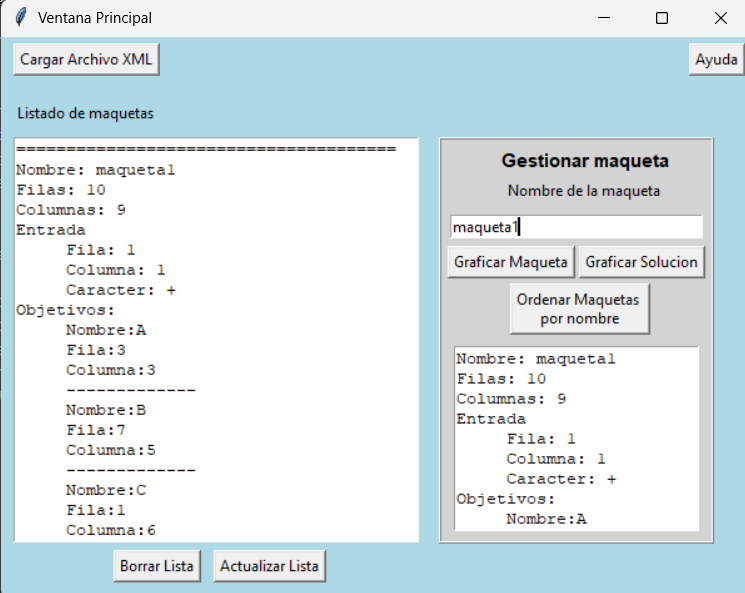
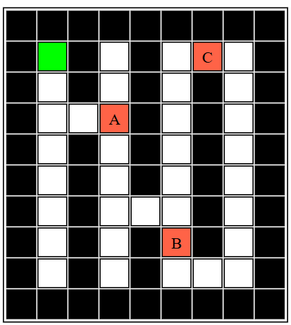
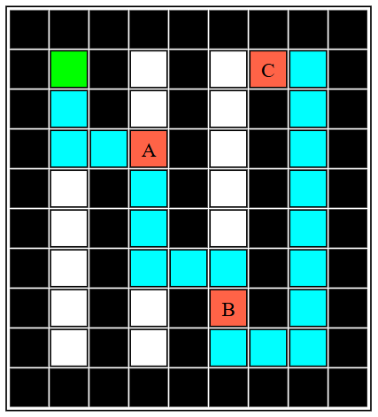

## Intelligent Maze Solver for Mechatronic Challenge – IPC2 Project
This project was developed as part of the course Introducción a la Programación y Computación 2 at Universidad de San Carlos de Guatemala. It simulates an autonomous device navigating a maze-like model to collect ordered objectives, using a pathfinding algorithm that avoids retracing any previously visited path segment.

### Project Overview

The Ministry of Education of Guatemala issued a challenge to design a mechatronic solution for collecting targets placed on a grid-based model. The maze consists of walls, paths, and objectives (marked as A, B, X, M, etc.). The robot must traverse from the entrance and collect objectives in a specific order without reusing paths.

This solution was built with:

- Python (strictly using custom-built data structures, no native lists/dicts/sets)
- Object-Oriented Programming (OOP)
- XML parsing for model inpu
- Graph traversal algorithms for pathfinding
- Graphviz for graphical reports and visualizations

### Key Features

- Load multiple mazes from one or more XML input files.
- Maze models support walls (*), paths (-), and targets.

- Calculate linear, non-repeating paths for target collection.

- Display the solution graphically using Graphviz.

- Built-in menu-driven console interface for:

  - Initializing system

  - Managing and listing maze configurations

  - Visualizing mazes and solution paths

  - Providing help and student info

### Graphical User Interface (Tkinter)
The application features a simple and intuitive GUI built with Tkinter. Users can load XML files, visualize mazes, and trigger the solving algorithm with just a few clicks.



### Input Format

```xml 
<config>
<maquetas>
<maqueta>
<nombre> maqueta1 </nombre>
<filas> 10 </filas>
<columnas> 9 </columnas>
<entrada>
<fila> 1 </fila>
<columna> 1 </columna>
</entrada>
<objetivos>
<objetivo>
<nombre> A </nombre>
<fila> 3 </fila>
<columna> 3 </columna>
</objetivo>
<objetivo>
<nombre> B </nombre>
<fila> 6 </fila>
<columna> 4 </columna>
</objetivo>
<objetivo>
<nombre> C </nombre>
<fila> 1 </fila>
<columna> 6 </columna>
</objetivo>
</objetivos>
<estructura> **********-*-*---**-*-*-*-**---*-*-**-*-*-*-**-*-*-*-**-*---*-**-*-*-*-**-*-*---********** </estructura>
</maqueta>
<config>
<maquetas>
```

### Maze Layout Preview (Graphviz)
This is the initial representation of the maze loaded from the XML input. It highlights walls, paths, entry point, and the objectives to collect.



### Solved Maze Path (Graphviz)
After processing the maze, the algorithm computes a valid path to collect the objectives in the required order without reusing any path segment.



### Technologies & Techniques
- Language: Python (custom-built data structures only)
- Paradigm: Object-Oriented Programming (OOP)
- Graphics: Graphviz .dot rendering for maze layouts and solution paths
- Input: XML Parsing using custom parsers


